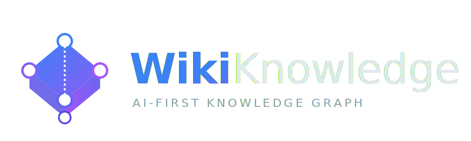

# WikiKnowledge. Knowledge engineering for Humans and AIs.

WikiKnowledge is designed to solve the problem of "fragmented" knowledge by building a hierarchical, fractal knowledge graph. Unlike Wikipedia, which can be difficult to follow as a structured educational path, WikiKnowledge uses "overview" articles (category articles) to provide summary-driven pathways through different layers of information. Combination of the hierarchical structure and wiki tools allows users and AIs to easily navigate through the knowledge graph, while also providing a clear overview of the relationships between different topics.

See [knowledge/articles/overview.md](knowledge/articles/overview.md) for the overview of the project.

TODO:

- [ ] add frontend-looking MCP tools for Chat agent specifically (check current article, help user modify it, suggest new categories or articles, etc.). Probably can be done by sending "context" to backend
- [ ] multiple knowledge bases on one server
- [ ] move article (rename)
- [ ] readonly mode
- [ ] sections editing (or better block structure)
- [ ] @mcp.resource support
- [ ] implement the dirty articles update cascading with AI
- [ ] add MongoDB/SQLite support for storing the knowledge graph
- [ ] sync, export/import and migrations for DBs
- [ ] add revision hooks for the Storage abstraction layer, with optional transactions support. Can use git for file system backing. Has parallel access implications.
- [ ] diff-match-patch revision history for SQLite
- [ ] implement purgeable index cache in `knowledge/.index`
- [ ] implement authentication
- [ ] provide response techical details in chat when possible (token count, t/s)
