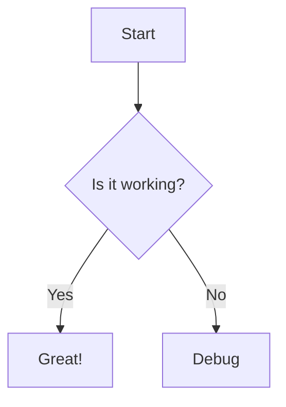

---
categories:
- markup-conventions
created: '2026-06-30T04:23:31.513890+00:00'
id: mermaid-diagrams
modified: '2026-06-30T04:23:31.513915+00:00'
tags:
- markup
- mermaid
- diagrams
- ui
title: Mermaid Diagrams
type: leaf
---

<!-- human:start -->
WikiKnowledge supports rendering Mermaid diagrams directly from Markdown code blocks.

To embed a diagram in your article, use a standard markdown fenced code block and specify `mermaid` as the language:

The frontend uses `marked.js` and `mermaid.js` to intercept these code blocks and render them interactively within the article viewer and editor preview. This ensures diagrams stay in sync with the document content and are seamlessly rendered without requiring external images.
<!-- human:end -->