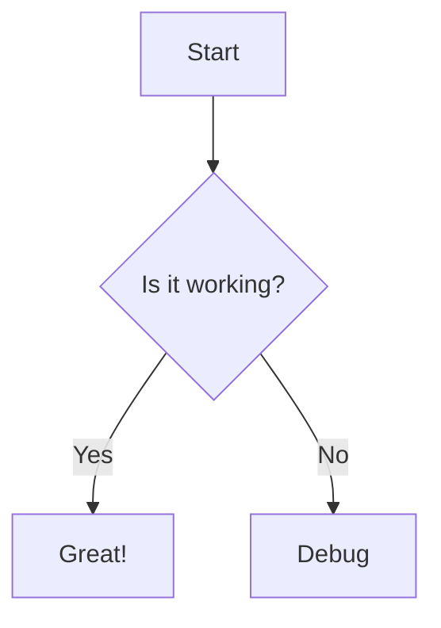
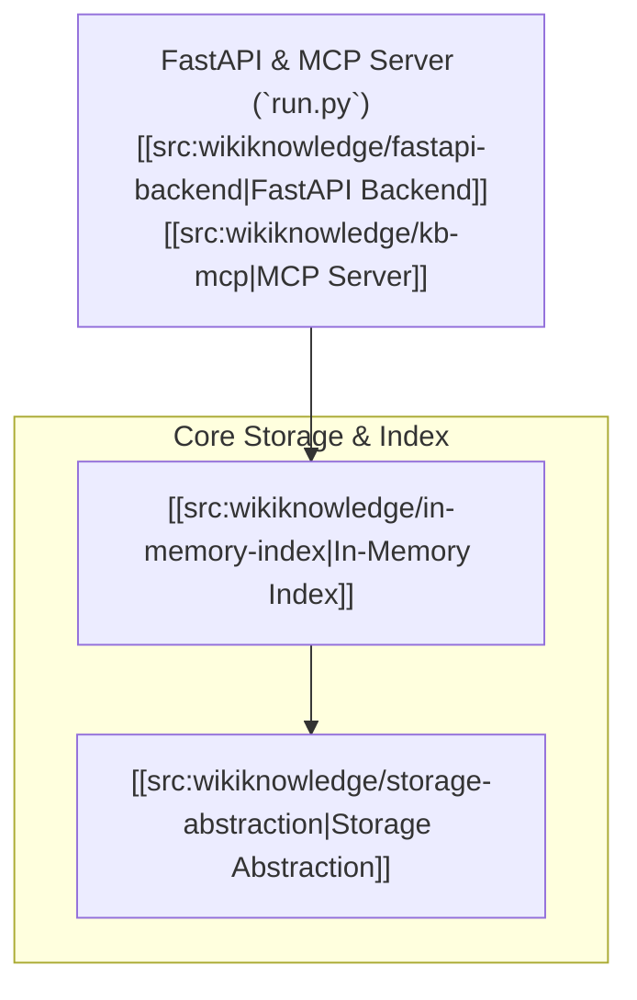

---
categories:
- markup-conventions
created: '2026-06-30T04:23:31.513890+00:00'
id: mermaid-diagrams
modified: '2026-09-25T11:19:40.550373+00:00'
tags:
- markup
- mermaid
- diagrams
- ui
- wiki-links
title: Mermaid Diagrams
type: leaf
---

# Mermaid Diagrams

<!-- human:start -->
WikiKnowledge supports rendering Mermaid diagrams directly from Markdown code blocks with native support for clickable wiki links within diagram nodes.

To embed a diagram in your article, use a standard markdown fenced code block and specify `mermaid` as the language:

```mermaid
graph TD
    A[Start] --> B{Is it working?};
    B -- Yes --> C[Great!];
    B -- No --> D[Debug];
```

The frontend uses `marked.js` and `mermaid.js` to intercept these code blocks and render them interactively within the article viewer and editor preview. This ensures diagrams stay in sync with the document content and are seamlessly rendered without requiring external images.

## Interactive Wiki Links in Diagrams

Diagram nodes can contain `[[wiki-links]]`, enabling architectural visuals and flowcharts to serve as interactive navigation maps:

- **Standard Wiki Links**: `[[article-id]]` or `[[article-id|Display Text]]`
- **Source Code Virtual Articles**: `[[src:source-name/module-path|Display Text]]`
- **Google Drive Documents**: `[[gdrive:doc-id|Display Text]]`
- **Anchor Links**: `[[article-id#section-anchor|Display Text]]`

### Example: Architectural Diagram with Links

```mermaid
flowchart TD
    App["FastAPI & MCP Server (`run.py`)<br/>[[src:wikiknowledge/fastapi-backend|FastAPI Backend]]<br/>[[src:wikiknowledge/kb-mcp|MCP Server]]"]
    
    subgraph Core["Core Storage & Index"]
        Index["[[src:wikiknowledge/in-memory-index|In-Memory Index]]"]
        Storage["[[src:wikiknowledge/storage-abstraction|Storage Abstraction]]"]
    end
    
    App --> Index
    Index --> Storage
```

### Rendering & Interaction Behavior

1. **Pre-Render Resolution**: Before Mermaid renders the diagram, the viewer resolves `[[...]]` markup into styled anchor elements (`<a class="wiki-link">`).
2. **Visual Indicators**: Links inside diagram nodes retain standard WikiKnowledge styling, including source indicators (e.g. `🔌` for source code, `☁️` for Google Drive) and missing/disconnected states.
3. **SPA Routing**: Clicking a link inside a diagram navigates smoothly to the target article via hash-based routing without reloading the application.
4. **Multiple Links per Node**: A single node label can contain multiple links separated by text or line breaks (` `).
<!-- human:end -->