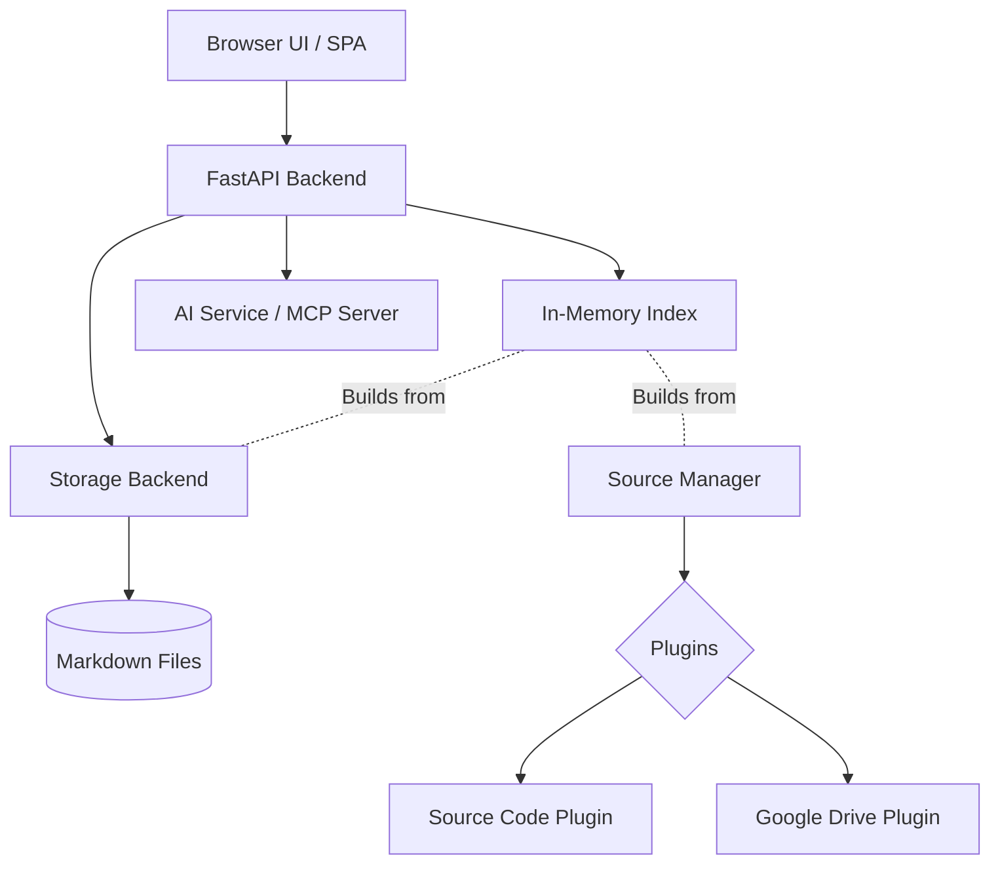

---
categories:
- overview
created: '2026-06-19T21:00:00+00:00'
id: system-architecture
modified: '2026-07-18T06:38:45.257088+00:00'
tags:
- architecture
- overview
- design
title: System Architecture
type: category
---

<!-- human:start -->
This category outlines the internal implementation and backend engineering architecture of the WikiKnowledge system. 

It covers the technical execution details of the graph database, the API layer, and the extensible plugin system, isolated entirely from user-facing authoring manuals.

## Architecture Overview

<!-- human:end -->

<!-- ai:start -->
### [[src:wikiknowledge/ai-service-architecture|AI Service & MCP Architecture]]
Explains the backend implementation of WikiKnowledge's AI integration, detailing how `AIService` manages FastAPI lifecycles and the active Model Context Protocol execution loop.

### [[src:wikiknowledge/fastapi-backend|FastAPI Backend]]
Details the REST API layer that handles requests and serves data to the frontend UI and AI integrations.

### [[src:wikiknowledge/in-memory-index|In-Memory Index]]
Describes the core graph database mechanism that powers WikiKnowledge, allowing fast traversal of wiki links and categories without a traditional SQL database.

### [[src:wikiknowledge/kb-manager|Knowledge Base Manager]]
Explains the lifecycle and configuration of knowledge base instances running inside the backend.

### [[src:wikiknowledge/storage-abstraction|Storage Abstraction Layer]]
Outlines how WikiKnowledge abstracts data storage, allowing swapping between flat markdown files and NoSQL databases.

### [[local-setup-and-mcp|Local Setup and MCP Configuration]]
The deployment instructions for standing up the backend architecture locally and configuring the Model Context Protocol.

### [[knowledge-sources|Knowledge Sources]]
The architecture behind the plugin system that allows external data (like source code or Google Drive) to be indexed natively into the knowledge graph.

### [[src:wikiknowledge/data-models|Data Models]]
Pydantic data model foundation for WikiKnowledge articles, resources, and links.

### [[src:wikiknowledge/markdown-storage|Markdown Storage Backend]]
Implements the StorageBackend contract using the local filesystem, storing articles as Markdown files with YAML frontmatter.

### [[src:wikiknowledge/refactoring|Refactoring Operations]]
Core operations for refactoring and renaming articles and resources across the knowledge base with cross-article link updates.
<!-- ai:end -->